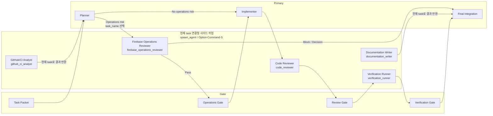

# DevLog_Firebase

DevLog의 Firebase Cloud Functions와 Firestore index 설정을 관리하는 저장소입니다.

## 구성

- `firebase.json`: Firebase Functions, Firestore index, emulator 설정
- `firebase.test.json`: 테스트용 Firebase emulator 설정
- `firestore.index.json`: Firestore composite index 설정
- `functions`: Cloud Functions TypeScript 소스

## AI 역할 분리



| 역할 | 정확한 `task_name` / Custom Agent | 모델 | 담당 | 다음 흐름 |
| --- | --- | --- | --- | --- |
| Planner | active main agent | Primary | 이슈, 요청, 변경 범위, role routing 정리 | Implementer / Firebase Operations Reviewer |
| Implementer | active main agent | Primary | task packet 기준 코드 또는 문서 수정 | Code Reviewer |
| Firebase Operations Reviewer | `firebase_operations_reviewer` | `gpt-5.3-codex-spark` (`Lightweight`) | deploy scope, env, Firestore database, index, data-shape, migration 위험 검토 | Implementer / Final Integration |
| Code Reviewer | `code_reviewer` | `gpt-5.3-codex-spark` (`Lightweight`) | diff 기준 버그, 회귀, 테스트 누락, scope drift 검토 | Verification Runner |
| Verification Runner | `verification_runner` | `gpt-5.3-codex-spark` (`Lightweight`) | build, test, docs check 결과 기록 | Final Integration |
| GitHub/CI Analyst | `github_ci_analyst` | `gpt-5.3-codex-spark` (`Lightweight`) | issue, PR thread, review comment, workflow run, CI log 분석 | Planner |
| Documentation Writer | `documentation_writer` | `gpt-5.3-codex-spark` (`Lightweight`) | PR 본문, release note, README, issue/comment 문안 작성 | Final Integration |

`Lightweight`와 `Fast` 역할은 현재 main task에 연결되는 사이드 작업으로 실행합니다. 도구에서는 `spawn_agent`, UI에서는 `Option-Command-S`를 사용하며, 역할 결과는 현재 main task로 돌아와 `Primary`가 검토하고 통합합니다.

`spawn_agent.task_name`은 표의 이름, `.codex/agents/<name>.toml` 파일명, TOML의 `name`과 정확히 일치해야 합니다. 임의의 접두어나 접미사를 붙인 이름은 configured custom agent 위임으로 인정하지 않습니다.

같은 역할에 후속 작업을 맡길 때는 새 이름의 agent를 만들지 않고 기존 agent에 `followup_task`를 전달합니다. 외부 `codex exec`, 별도의 사용자 소유 `create_thread`, 임의 이름의 일반 sub-agent는 저장소 역할 위임 수단이 아닙니다. 이러한 실행 경로의 실패만으로 configured custom agent나 고정 모델을 사용할 수 없다고 판단하지 않습니다.

## 환경 변수

Firebase CLI의 `--project`로 staging 또는 prod Firebase project를 선택합니다. 각 project에 배포된 함수는 인자 없는 `getFirestore()`로 해당 project의 `(default)` database를 사용합니다.

일반 환경 변수를 추가하면 Firebase CLI가 `functions/.env`와 선택한 project 또는 alias에 대응하는 `functions/.env.<project or alias>`를 자동으로 읽습니다.

일반 환경 변수 파일은 로컬 전용으로 관리하며 Git에 포함하지 않습니다.

GitHub, Google, Apple 인증 설정은 일반 환경 변수나 `.env`에 저장하지 않고 Firebase project별 Secret Manager의 `GITHUB_OAUTH_CONFIG`, `GOOGLE_OAUTH_CONFIG`, `APPLE_AUTH_CONFIG` JSON Secret에서 각각 관리합니다.

GitHub JSON에는 `clientId`, `clientSecret`, `callbackURL` 필드를 모두 포함합니다.

Google JSON에는 `clientId`, `clientSecret` 필드를 필수로 포함합니다. `callbackURL`은 사용하지 않습니다.

Google `clientSecret`은 같은 환경의 `GOOGLE_OAUTH_CONFIG.clientId`에 대응하는 Web OAuth client에서 발급된 값이어야 합니다.

iOS Google Sign-In 설정은 환경별 Firebase Secret과 다음과 같이 일치해야 합니다.

- staging `GIDServerClientID` = staging `GOOGLE_OAUTH_CONFIG.clientId`
- production `GIDServerClientID` = production `GOOGLE_OAUTH_CONFIG.clientId`

Google 인증은 서버 callback route와 Firebase Hosting rewrite를 사용하지 않습니다. GitHub 인증은 기존 `callbackURL`과 Hosting rewrite를 계속 사용합니다.

Apple JSON에는 `teamId`, `clientId`, `keyId`, `privateKey` 필드를 모두 포함합니다.

## 로컬 빌드

```bash
cd functions
npm ci
npm run build
```

`functions/node_modules`와 `functions/lib`는 로컬 생성물입니다. Git에는 포함하지 않습니다.

## CI

Pull Request에서만 build 검증을 실행합니다.

CI는 `functions`에서 다음 명령만 확인합니다.

```bash
npm ci
npm run build
```

GitHub Actions의 action 런타임은 Node 24 대응 버전을 사용하고, Functions 빌드 Node 버전은 `functions/package.json`의 `engines.node`와 맞춘 Node 22를 사용합니다.

## 배포

현재 CD workflow는 없습니다. 배포는 필요한 시점에 수동으로 진행합니다.

이 저장소에는 `.firebaserc`를 커밋하지 않습니다.

배포할 Firebase project는 명령에서 명시합니다.

```bash
firebase deploy --project <staging-project-id> --only functions:<functionName>
firebase deploy --project <prod-project-id> --only functions:<functionName>
```

양쪽 project에는 같은 함수 이름을 배포하며, 각 함수는 해당 project의 `(default)` database만 사용합니다.

기존 prod named database의 데이터를 prod project의 `(default)`로 이전하기 전에는 이 변경을 prod project에 배포하지 않습니다.

여러 함수를 배포해야 할 때도 전체 일괄 배포보다 필요한 함수 단위로 나누어 배포합니다.

GitHub OAuth 전환 배포 전에는 staging과 prod 모두 `oauthSessions.expiresAt`, `oauthTickets.expiresAt` TTL 설정을 먼저 반영합니다.
